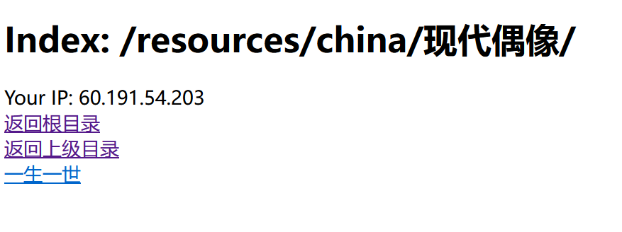

# movie-server
一个自建视频网站的工具，将个人下载的视频放到该web应用目录中，可以进行在线观看。布局类似FTP。
## 适合场景
视频源在国外等低速访问网站，而本地缓存空间不足或本地观看不便携带。

## 使用方法
克隆项目，并放到`tomcat`的`webapps`工作目录下即可。不断往其子目录添加视频就可以在浏览器中看到。



## 支持的视频
- mp4
- m3u8 HLS格式

## 视频转码脚本解释
- make_m3u8.sh
用于将mp4视频转码生成m3u8 HLS格式。后者更加适合大视频的观看。因为播放mp4时，需要等服务器先将视频全部加载到服务器内存中。大容量的mp4此时预先加载较慢。
```shell
bash make_m3u8.sh 你的mp4文件路径
bash make_m3u8.sh 你的包含mp4文件的目录（不递归）
```

- ts2mp4.sh
用于将ts格式（m3u8 HLS的视频片段）转化为mp4。
```shell
bash ts2mp4.sh 你的ts格式文件路径
```

## m3u8格式视频下载
欢迎访问[GCS-ZHN/m3u8Downloader](https://github.com/GCS-ZHN/m3u8Downloader)

